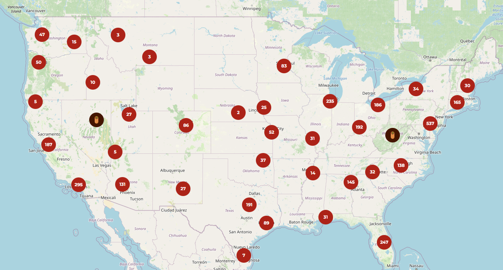
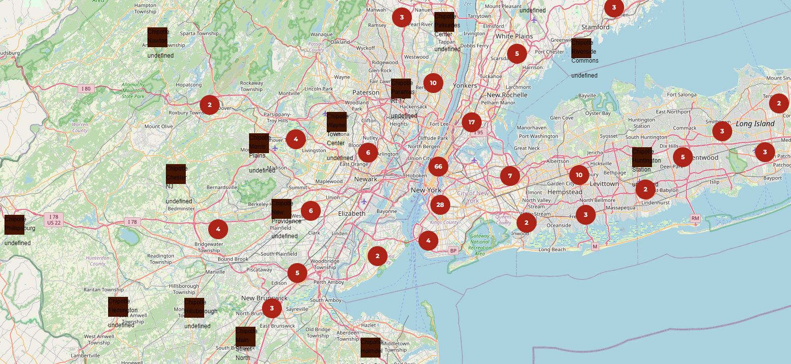

+++
title = 'SecondDevBlogChipotle'
date = 2024-06-20T21:24:58-04:00
draft = false
+++

## Chipotle Social Media Site

As I mentioned at the tail end of yesterdays blog, today was mainly to start work on moving the data to a database and figure out the API stuff

However, when I started working today I found that I could just use Node.js to create the API server, and use a library to port the csv into json that could be used by the Javascript in index.html

This saved me a lot of pain, I will still need to eventually set up a database to store user data and reviews, among other things, but I actually got to work on the looks of the site today!

I got the API server set up quite fast with the help of GitHub Copilot and was able to get all of the locations shown on the map

This was quite laggy, since each of the 3397 locations were being shown at once

Luckily Leaflet has already thought of this and has a grouping protocol that I could use!

I coded all of that up and then decided I wanted to take a stab at creating cooler icons for the Chipotles, I decided on a circle with a burrito icon in the middle that when zoomed in enough turns into a square with details about the Chipotle

I also made some minor changes to the zooming of the map as well as when tooltips would show up and where.

All in all a very productive and exciting day! I will be spending the rest of the night trying to clean the data a bit more for the information boxes on the web app.

Tomorrow I hope to tackle what happens when a user clicks on an individual Chipotle location, what they see, how they can interact, what information is most important to the user, etc!

How the site looks at the end of day 2!

